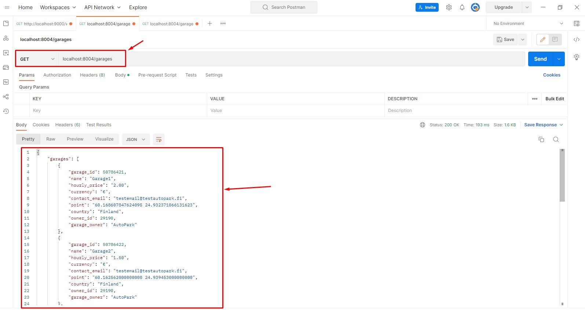
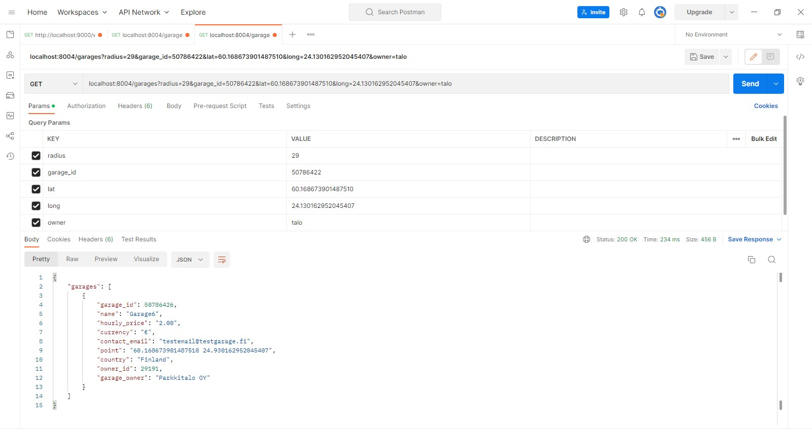
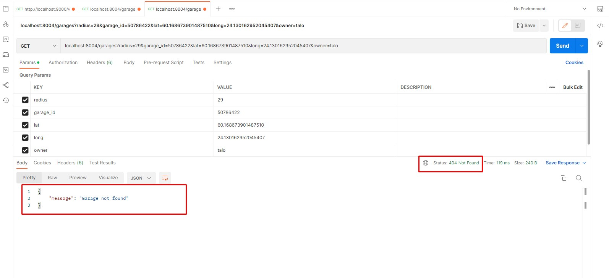
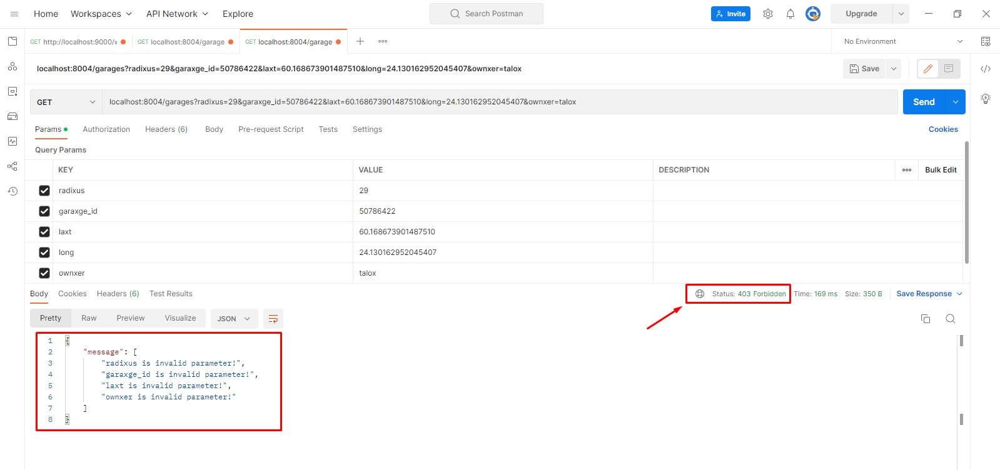
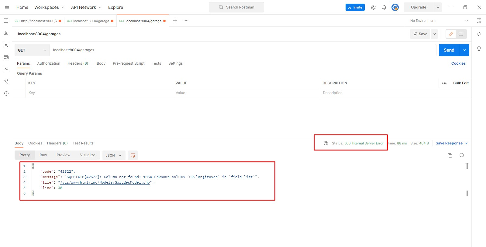

# Parkman Garage API

ParkMan's backend handles fetching of this information based on a user's current location and time.

# Installation

- Clone the entire project.
- Run docker compose command. Make sure you start the Docker Desktop.

```bash
  docker compose up -d
```

- It will take few minutes to install nginx, PHP 8, mysql, and phpmyadmin.
- Once installation completed, you can access the site.

```bash
  localhost:8004
```

- You can access the phpmyadmin using the following information.


```bash
  localhost:9004

  Server: mysql
  Username: root
  Password: secret
```

## Import Database

- You will get a "garage_db.sql" file inside "src" folder. Import this database file.

## API Reference

You need to install Postman/Insomnia application to test the API endpoints.

### Get all the garages info.

```http
  GET /garages
```

### Filter garages info

#### 1. Get garages by owner name.

```http
  GET /garages?owner=xyz
```

| Parameter | Type     | Description  |
| :-------- | :------- | :----------- |
| `owner`   | `string` | **Required** |

#### 2. Get garages by owner id.

```http
  GET /garages?owner_id=12345
```

| Parameter  | Type  | Description  |
| :--------- | :---- | :----------- |
| `owner_id` | `int` | **Required** |

#### 3. Get garages by garage id.

```http
  GET /garages?garage_id=123456
```

| Parameter   | Type  | Description  |
| :---------- | :---- | :----------- |
| `garage_id` | `int` | **Required** |

#### 4. Get garages by country.

```http
  GET /garages?country=finland
```

| Parameter | Type     | Description  |
| :-------- | :------- | :----------- |
| `country` | `string` | **Required** |

#### 5. Get garages by longitude, latitude, and radius.

```http
  GET /garages?long=60.168673901487510&lat=24.930162952045407&radius=4
```

| Parameter | Type      | Description  |
| :-------- | :-------- | :----------- |
| `long`    | `decimal` | **Required** |
| `lat`     | `decimal` | **Required** |
| `radius`  | `int`     | **Required** |

## Demo

### All Garages List Response



### Garages Filter Response



### Garage Not Found Response



### Invalid Parameter Response



### Internal Server Response



## Acknowledgements

- [docker](https://www.docker.com/)
- [php8](https://www.php.net)
- [composer](https://getcomposer.org/download/)
- [phpmyadmin](https://www.phpmyadmin.net/)
- [mysql](https://www.mysql.com/)
- [nginx](https://www.nginx.com/)
